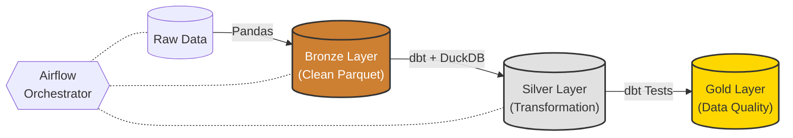

# Medallion Architecture Demo (Airflow + dbt + DuckDB)

Este proyecto implementa un pipeline de datos dividido en tres capas:

Bronze: limpieza de datos crudos (Pandas)

Silver: transformación y modelado con dbt + DuckDB

Gold: validación de calidad con dbt tests y generación de reportes JSON

El pipeline corre completamente dentro de Docker usando Airflow como orquestador.

## Estructura del Proyecto
```
├── dags/
│   └── medallion_medallion_dag.py
├── data/
│   ├── raw/
│   ├── clean/
│   └── quality/
├── dbt/
│   ├── models/
│   ├── tests/
│   └── dbt_project.yml
├── include/
│   └── transformations.py
├── profiles/
│   └── profiles.yml
├── warehouse/
│   └── medallion.duckdb (generado automáticamente)
└── docker-compose.yml
```

## Diagrama de arquitectura


## Prerrequisitos
* Docker & Docker Compose (v2.x recomendado)
* Python 3.9+ (solo para herramientas de linting local)

## Cómo ejecutar el proyecto
### 1. Levantar Airflow + Postgres
En Windows PowerShell, ejecuta:

```bash
docker compose up --build -d
```

Airflow UI estará disponible en:

http://localhost:8080

El usuario administrador de Airflow se crea automáticamente durante el paso de inicialización del contenedor (airflow-init).
Las credenciales siempre serán:

Usuario: airflow
Contraseña: airflow


El comando utilizado dentro del docker-compose.yml es:

airflow users create \
  --username airflow \
  --password airflow \
  --firstname Admin \
  --lastname User \
  --role Admin \
  --email admin@example.com


### 2. Ejecutar el DAG

Entrá a la UI de Airflow y activá el DAG:

medallion_pipeline

Luego ejecutá un run manual con la fecha que quieras.

### 3. Inspeccionar cada capa (Bronze / Silver / Gold)

Para esto **entrás en el contenedor Airflow**:
```bash
docker exec -it examen_ing_de_sw_n_data_final-airflow-webserver-1 bash
```
BRONZE – Ver parquet limpio
```bash

python - << 'EOF'
import duckdb
df = duckdb.query("""
SELECT *
FROM read_parquet('/opt/airflow/data/clean/transactions_20251201_clean.parquet')
LIMIT 10
""").fetchdf()
print(df)
EOF

```
SILVER – Ver tablas en DuckDB
```bash
python - << 'EOF'
import duckdb
db = duckdb.connect('/opt/airflow/warehouse/medallion.duckdb')
print(db.execute("SHOW TABLES").fetchdf())
EOF
```
Ver schema de una tabla
```bash
python - << 'EOF'
import duckdb
db = duckdb.connect('/opt/airflow/warehouse/medallion.duckdb')
print(db.execute("DESCRIBE fct_customer_transactions").fetchdf())
EOF
```
Ver primeras filas
```bash
python - << 'EOF'
import duckdb
db = duckdb.connect('/opt/airflow/warehouse/medallion.duckdb')
print(db.execute("SELECT * FROM fct_customer_transactions LIMIT 10").fetchdf())
EOF
```
GOLD – Validación de Data Quality

Los resultados de tests de dbt se almacenan automáticamente en:

data/quality/dq_results_<ds>.json


Ejemplo de contenido:
```
{
  "status": "passed",
  "ds_nodash": "20251205",
  "command": "test",
  "stdout": "...",
  "stderr": ""
}
```
4. Linting y formato del código

El proyecto incluye herramientas para analizar y formatear código:

Activar entorno virtual:
```bash
python -m venv .venv
.\.venv\Scripts\activate
pip install -r requirements.txt
```

Black (formato):
black dags include

isort (ordenar imports):
isort dags include

Pylint (análisis estático):
pylint dags/*.py include/*.py


## Detener el proyecto
Para detener los contenedores y remover la red:
docker compose down

## Mejoras a futuro
* Modelado Star Schema: Migrar hacia un STAR schema, separando dim_customer y dim_time para optimizar consultas OLAP.
* Alertas y Monitoreo: Configurar notificaciones para que cuando falle un test de dbt (actualmente solo guarda el JSON) se lo pueda identificar rapido e implementar un dashboard para visualizar los datos.
* Carga Incremental: Configurar los modelos de dbt como incremental para procesar solo los datos nuevos del día y evitar re-procesar todo el histórico.
