# Medallion Architecture Demo (Airflow + dbt + DuckDB)

Este proyecto implementa un pipeline de datos dividido en tres capas:

Bronze: limpieza de datos crudos (Pandas)

Silver: transformación y modelado con dbt + DuckDB

Gold: validación de calidad con dbt tests y generación de reportes JSON

El pipeline corre completamente dentro de Docker usando Airflow como orquestador.

## Estructura del Proyecto
```
├── dags/
│   └── medallion_medallion_dag.py
├── data/
│   ├── raw/
│   ├── clean/
│   └── quality/
├── dbt/
│   ├── models/
│   ├── tests/
│   └── dbt_project.yml
├── include/
│   └── transformations.py
├── profiles/
│   └── profiles.yml
├── warehouse/
│   └── medallion.duckdb (generado automáticamente)
└── docker-compose.yml
```

## Diagrama de arquitectura

```mermaid
flowchart LR
    Raw[("Raw Data")]
    Bronze[("Bronze Layer\n(Clean Parquet)")]
    Silver[("🥈Silver Layer\n(Transformation)")]
    Gold[("Gold Layer\n(Data Quality)")]
    Airflow{{"Airflow\nOrchestrator"}}

    Raw -->|Pandas| Bronze
    Bronze -->|dbt + DuckDB| Silver
    Silver -->|dbt Tests| Gold
    
    Airflow -.- Raw
    Airflow -.- Bronze
    Airflow -.- Silver

    %% Estilos de colores
    style Bronze fill:#cd7f32,stroke:#333,stroke-width:2px,color:white
    style Silver fill:#e1e1e1,stroke:#333,stroke-width:2px
    style Gold fill:#ffd700,stroke:#333,stroke-width:2px
```


## Prerrequisitos
* Docker & Docker Compose (v2.x recomendado)
* Python 3.9+ (solo para herramientas de linting local)

## Cómo ejecutar el proyecto
1. Levantar Airflow + Postgres

En Windows PowerShell:

docker compose up --build -d


Airflow UI estará disponible en:

🔗 http://localhost:8080

Usuario: airflow
Contraseña: airflow

▶️ 2. Ejecutar el DAG

Entrá a la UI de Airflow y activá el DAG:

medallion_pipeline

Luego ejecutá un run manual con la fecha que quieras.

🔍 3. Inspeccionar cada capa (Bronze / Silver / Gold)

Para esto **entrás en el contenedor Airflow**:

docker exec -it examen_ing_de_sw_n_data_final-airflow-webserver-1 bash

🟫 BRONZE – Ver parquet limpio
python - << 'EOF'
import duckdb
df = duckdb.query("""
SELECT *
FROM read_parquet('/opt/airflow/data/clean/transactions_20251201_clean.parquet')
LIMIT 10
""").fetchdf()
print(df)
EOF

🥈 SILVER – Ver tablas en DuckDB
Ver todas las tablas
python - << 'EOF'
import duckdb
db = duckdb.connect('/opt/airflow/warehouse/medallion.duckdb')
print(db.execute("SHOW TABLES").fetchdf())
EOF

Ver schema de una tabla
python - << 'EOF'
import duckdb
db = duckdb.connect('/opt/airflow/warehouse/medallion.duckdb')
print(db.execute("DESCRIBE fct_customer_transactions").fetchdf())
EOF

Ver primeras filas
python - << 'EOF'
import duckdb
db = duckdb.connect('/opt/airflow/warehouse/medallion.duckdb')
print(db.execute("SELECT * FROM fct_customer_transactions LIMIT 10").fetchdf())
EOF

🟡 GOLD – Validación de Data Quality

Los resultados de tests de dbt se almacenan automáticamente en:

data/quality/dq_results_<ds>.json


Ejemplo de contenido:

{
  "status": "passed",
  "ds_nodash": "20251205",
  "command": "test",
  "stdout": "...",
  "stderr": ""
}

🧹 4. Linting y formato del código

El proyecto incluye herramientas para analizar y formatear código:

Activar entorno virtual:

python -m venv .venv
.\.venv\Scripts\activate
pip install -r requirements.txt

Black (formato):
black dags include

isort (ordenar imports):
isort dags include

Pylint (análisis estático):
pylint dags/*.py include/*.py


## Detener el proyecto
Para detener los contenedores y remover la red:
docker compose down

## Mejoras a futuro
* Incorporar dimensiones como dim_customer y dim_date permite transformar el modelo de datos desde un enfoque transaccional hacia un esquema en estrella optimizado 
para análisis. Esto mejora la trazabilidad, reduce duplicación de información, y habilita consultas analíticas más complejas con menor costo computacional.
* Mejorar la observabilidad implica centralizar resultados de calidad, habilitar dashboards de monitoreo y automatizar alertas ante fallos. Esto permite detectar anomalías más rápido,
  facilita auditorías y aporta confiabilidad al pipeline.
* Implementar modelos incrementales permite que el pipeline procese únicamente nuevas particiones de datos, evitando recalcular toda la historia y mejorando la eficiencia.
  Esto es fundamental para escalar a volúmenes grandes de datos.
